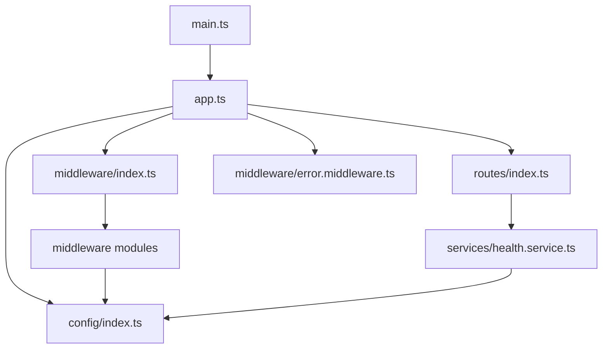

# Design Document: API Gateway Refactoring

## Overview

This design refactors the API Gateway from a monolithic single-file application into a well-structured, maintainable, and testable codebase. The refactoring maintains all existing functionality while improving code organization, type safety, and testability.

The current implementation (~200 lines in a single file) will be reorganized into a modular architecture with clear separation of concerns:
- Configuration management
- Middleware components
- Health check service
- Proxy routing
- Error handling
- Application bootstrap

This design prioritizes backward compatibility - all existing API contracts, endpoints, and behaviors remain unchanged. The refactoring is purely internal, improving developer experience without affecting external consumers.

## Architecture

### Directory Structure

```
api-gateway/
├── src/
│   ├── config/
│   │   └── index.ts              # Configuration loading and validation
│   ├── middleware/
│   │   ├── index.ts              # Middleware composition and ordering
│   │   ├── cors.middleware.ts    # CORS configuration
│   │   ├── compression.middleware.ts  # Response compression
│   │   ├── timeout.middleware.ts # Request timeout handling
│   │   ├── arcjet.middleware.ts  # Bot and VPN detection
│   │   └── error.middleware.ts   # Centralized error handling
│   ├── services/
│   │   └── health.service.ts     # Health check logic
│   ├── routes/
│   │   └── index.ts              # Proxy route configuration
│   ├── types/
│   │   └── index.ts              # TypeScript type definitions
│   ├── utils/
│   │   └── logger.ts             # Logging utilities
│   ├── app.ts                    # Express app setup
│   └── main.ts                   # Application entry point
├── tests/
│   ├── unit/
│   │   ├── config/
│   │   ├── middleware/
│   │   ├── services/
│   │   └── routes/
│   └── helpers/
│       └── mocks.ts              # Test utilities and mocks
├── jest.config.js
└── package.json
```

### Architectural Principles

1. **Separation of Concerns**: Each module has a single, well-defined responsibility
2. **Dependency Injection**: External dependencies (Arcjet, fetch) are injected for testability
3. **Configuration as Code**: All configuration centralized and validated at startup
4. **Fail Fast**: Invalid configuration causes immediate startup failure with clear errors
5. **Testability First**: All modules designed to be unit testable in isolation

### Module Dependencies



## Components and Interfaces

### Configuration Module (`config/index.ts`)

**Purpose**: Centralize all environment variable loading, validation, and type-safe access.

**Interface**:
```typescript
export interface ServerConfig {
  port: number;
  nodeEnv: 'development' | 'production' | 'test';
  isProd: boolean;
}

export interface CorsConfig {
  allowedOrigins: string[];
  credentials: boolean;
  allowedHeaders: string[];
}

export interface ServiceEndpoint {
  name: string;
  url: string;
  healthPath: string;
}

export interface ServicesConfig {
  auth: ServiceEndpoint;
  notification: ServiceEndpoint;
}

export interface SecurityConfig {
  arcjetKey?: string;
  arcjetEnabled: boolean;
}

export interface AppConfig {
  server: ServerConfig;
  cors: CorsConfig;
  services: ServicesConfig;
  security: SecurityConfig;
}

export function loadConfig(): AppConfig;
export function validateConfig(config: AppConfig): void;
```

**Behavior**:
- Loads environment variables using `dotenv`
- Provides sensible defaults for optional values
- Validates required values (throws if missing)
- Parses comma-separated lists (ALLOWED_ORIGINS)
- Returns immutable configuration object

**Validation Rules**:
- PORT must be a valid number (1-65535)
- NODE_ENV must be one of: development, production, test
- ALLOWED_ORIGINS must be non-empty
- Service URLs must be valid HTTP/HTTPS URLs

### Middleware Modules

#### CORS Middleware (`middleware/cors.middleware.ts`)

**Purpose**: Configure Cross-Origin Resource Sharing based on allowed origins.

**Interface**:
```typescript
export function createCorsMiddleware(config: CorsConfig): RequestHandler;
```

**Behavior**:
- Allows requests with no origin (mobile apps, Postman)
- Checks origin against whitelist
- Supports wildcard (*) for development
- Returns appropriate CORS headers

#### Compression Middleware (`middleware/compression.middleware.ts`)

**Purpose**: Enable gzip compression for responses to reduce bandwidth.

**Interface**:
```typescript
export function createCompressionMiddleware(): RequestHandler;
```

**Behavior**:
- Compression level: 6 (balanced)
- Threshold: 1KB (only compress larger responses)
- Excludes Server-Sent Events (SSE) streams
- Uses standard compression filter

#### Timeout Middleware (`middleware/timeout.middleware.ts`)

**Purpose**: Prevent requests from hanging indefinitely.

**Interface**:
```typescript
export function createTimeoutMiddleware(timeoutMs: number): RequestHandler[];
```

**Behavior**:
- Default timeout: 30 seconds
- Returns array: [timeout middleware, halt-on-timeout middleware]
- Halt middleware checks `req.timedout` flag
- Prevents further processing if timed out

#### Arcjet Middleware (`middleware/arcjet.middleware.ts`)

**Purpose**: Protect against bots, VPNs, proxies, and hosting providers.

**Interface**:
```typescript
export interface ArcjetConfig {
  key?: string;
  enabled: boolean;
  mode: 'LIVE' | 'DRY_RUN';
}

export function createArcjetMiddleware(config: ArcjetConfig): RequestHandler;
```

**Behavior**:
- Skips protection if disabled or no key provided
- Detects and blocks malicious bots
- Allows search engines and monitoring services
- Blocks VPN, proxy, hosting, and relay IPs
- Returns 403 Forbidden for blocked requests
- Fails open (allows request) on errors
- Logs all blocking decisions

#### Error Middleware (`middleware/error.middleware.ts`)

**Purpose**: Centralized error handling with consistent response format.

**Interface**:
```typescript
export interface ErrorResponse {
  error: string;
  message?: string;
  statusCode: number;
  timestamp: string;
}

export function errorHandler(
  err: Error,
  req: Request,
  res: Response,
  next: NextFunction
): void;
```

**Behavior**:
- Logs errors with stack traces
- Returns consistent JSON error format
- Maps error types to HTTP status codes
- Includes timestamp for debugging
- Hides internal errors in production

#### Middleware Index (`middleware/index.ts`)

**Purpose**: Compose and export middleware in correct order.

**Interface**:
```typescript
export function setupMiddleware(app: Express, config: AppConfig): void;
```

**Behavior**:
- Applies middleware in correct order:
  1. Compression
  2. Timeout
  3. Body parsing (JSON, URL-encoded)
  4. CORS
  5. Arcjet protection
- Ensures halt-on-timeout checks between body parsers

### Health Check Service (`services/health.service.ts`)

**Purpose**: Monitor gateway and upstream service health.

**Interface**:
```typescript
export interface ServiceHealth {
  name: string;
  status: 'ok' | 'error';
  latency?: number;
}

export interface HealthCheckResponse {
  status: 'ok' | 'degraded' | 'error';
  service: string;
  upstreams?: Record<string, ServiceHealth>;
  timestamp: string;
  error?: string;
}

export async function checkServiceHealth(
  url: string,
  name: string,
  timeoutMs?: number
): Promise<ServiceHealth>;

export async function checkAllServices(
  services: ServiceEndpoint[]
): Promise<HealthCheckResponse>;
```

**Behavior**:
- Checks each upstream service in parallel
- Measures response latency
- 5-second timeout per service
- Returns 200 if all services healthy
- Returns 503 if any service unhealthy
- Includes detailed status for each upstream
- Handles network errors gracefully

### Proxy Routes (`routes/index.ts`)

**Purpose**: Configure request routing to upstream services.

**Interface**:
```typescript
export interface ProxyRoute {
  path: string;
  target: string;
  preservePath?: boolean;
}

export function setupRoutes(app: Express, config: AppConfig): void;
```

**Behavior**:
- Routes are applied in priority order:
  1. `/health` - Gateway health check (not proxied)
  2. `/api/v1/notifications` - Notification service
  3. `/api/v1/location/request` - Notification service (silent push)
  4. `/` - Auth service (catch-all)
- Preserves original request paths
- Handles proxy errors with error middleware

### Application Bootstrap (`app.ts`)

**Purpose**: Create and configure Express application.

**Interface**:
```typescript
export function createApp(config: AppConfig): Express;
```

**Behavior**:
- Loads configuration
- Sets up middleware
- Sets up routes
- Adds error handler (must be last)
- Returns configured Express app

### Main Entry Point (`main.ts`)

**Purpose**: Start the HTTP server.

**Interface**:
```typescript
async function main(): Promise<void>;
```

**Behavior**:
- Loads configuration
- Creates Express app
- Starts HTTP server
- Logs startup message
- Handles startup errors

## Data Models

### Configuration Types

All configuration is strongly typed using TypeScript interfaces (defined in Components section above).

### Health Check Types

```typescript
// Service health status
type HealthStatus = 'ok' | 'error' | 'degraded';

// Individual service check result
interface ServiceHealth {
  name: string;
  status: 'ok' | 'error';
  latency?: number; // milliseconds
}

// Overall health check response
interface HealthCheckResponse {
  status: HealthStatus;
  service: string; // 'api-gateway'
  upstreams?: Record<string, ServiceHealth>;
  timestamp: string; // ISO 8601
  error?: string; // Only present on error
}
```

### Error Types

```typescript
// Standard error response
interface ErrorResponse {
  error: string; // Error type/category
  message?: string; // Human-readable message
  statusCode: number; // HTTP status code
  timestamp: string; // ISO 8601
}

// Timeout error
interface TimeoutError extends Error {
  name: 'TimeoutError';
  timeout: number; // milliseconds
}

// Proxy error
interface ProxyError extends Error {
  name: 'ProxyError';
  target: string; // Upstream service URL
  statusCode?: number;
}
```

## Correctness Properties

*A property is a characteristic or behavior that should hold true across all valid executions of a system—essentially, a formal statement about what the system should do. Properties serve as the bridge between human-readable specifications and machine-verifiable correctness guarantees.*


### Configuration Properties

**Property 1: Configuration validation rejects invalid inputs**
*For any* configuration object with missing required fields, the configuration validator should throw an error that identifies which required field is missing.
**Validates: Requirements 2.3, 2.5**

**Property 2: Configuration provides defaults for optional values**
*For any* optional configuration field that is not provided, the configuration loader should return a predefined default value.
**Validates: Requirements 2.4**

### Health Check Properties

**Property 3: Health check verifies all upstream services**
*For any* configured upstream service, the health check should attempt to reach it and include its status in the response.
**Validates: Requirements 4.2**

**Property 4: Health check includes latency for responsive services**
*For any* upstream service that responds successfully, the health check response should include a latency measurement in milliseconds.
**Validates: Requirements 4.3**

**Property 5: Health check returns 503 for unhealthy services**
*For any* upstream service that is unreachable or returns an error, the health check endpoint should return HTTP 503 status.
**Validates: Requirements 4.5**

**Property 6: Health check includes timestamps**
*For any* health check response, it should contain a valid ISO 8601 timestamp.
**Validates: Requirements 4.6**

**Property 7: Health check handles timeouts gracefully**
*For any* upstream service that times out, the health check should mark that service as unhealthy without crashing and should complete within a reasonable time.
**Validates: Requirements 4.7**

### Proxy Properties

**Property 8: Proxy routes requests to correct upstream**
*For any* configured route path, requests matching that path should be forwarded to the corresponding upstream service URL.
**Validates: Requirements 5.2**

**Property 9: Proxy preserves request paths**
*For any* request path that is proxied, the upstream service should receive the same path as the original request.
**Validates: Requirements 5.3**

**Property 10: Proxy handles upstream errors gracefully**
*For any* proxy request where the upstream service is unreachable or returns an error, the gateway should return an appropriate error response without crashing.
**Validates: Requirements 5.4**

### Error Handling Properties

**Property 11: Errors produce consistent response format**
*For any* error that occurs during request processing, the response should be a JSON object containing error, statusCode, and timestamp fields.
**Validates: Requirements 6.2, 6.3**

## Error Handling

### Error Categories

1. **Configuration Errors** (Startup)
   - Missing required environment variables
   - Invalid configuration values
   - Action: Log error and exit process with code 1

2. **Request Timeout Errors** (Runtime)
   - Request exceeds 30-second timeout
   - Status Code: 408 Request Timeout
   - Response: `{ error: "Request Timeout", statusCode: 408, timestamp: "..." }`

3. **Proxy Errors** (Runtime)
   - Upstream service unreachable: 502 Bad Gateway
   - Upstream service timeout: 504 Gateway Timeout
   - Upstream service error: Pass through status code
   - Response: `{ error: "Proxy Error", message: "...", statusCode: XXX, timestamp: "..." }`

4. **Security Errors** (Runtime)
   - Bot detected: 403 Forbidden
   - VPN/Proxy detected: 403 Forbidden
   - Response: `{ error: "Forbidden", message: "...", statusCode: 403, timestamp: "..." }`

5. **CORS Errors** (Runtime)
   - Origin not allowed: 403 Forbidden
   - Response: Browser handles (no custom response)

6. **Unexpected Errors** (Runtime)
   - Any unhandled exception
   - Status Code: 500 Internal Server Error
   - Response: `{ error: "Internal Server Error", statusCode: 500, timestamp: "..." }`
   - Action: Log full error with stack trace

### Error Logging

All errors are logged with:
- Timestamp
- Error type/category
- Error message
- Stack trace (for unexpected errors)
- Request context (method, path, IP)

Production mode hides internal error details from responses but logs them fully.

### Error Recovery

- **Configuration errors**: No recovery, process exits
- **Runtime errors**: Request fails, but server continues
- **Health check errors**: Individual service failures don't crash health endpoint
- **Proxy errors**: Returned to client, don't affect other requests

## Testing Strategy

### Testing Approach

This project uses a **dual testing approach** combining unit tests and property-based tests:

- **Unit tests**: Verify specific examples, edge cases, and error conditions
- **Property-based tests**: Verify universal properties across many generated inputs

Both types of tests are complementary and necessary for comprehensive coverage. Unit tests catch concrete bugs in specific scenarios, while property tests verify general correctness across a wide input space.

### Testing Framework

**Jest** is used as the testing framework with the following configuration:
- TypeScript support via `ts-jest`
- Minimum 100 iterations per property test
- Coverage reporting enabled (target: 80% coverage)
- Isolated test environment for each test file

### Test Organization

```
tests/
├── unit/
│   ├── config/
│   │   └── config.test.ts           # Configuration loading and validation
│   ├── middleware/
│   │   ├── cors.test.ts             # CORS middleware
│   │   ├── compression.test.ts      # Compression middleware
│   │   ├── timeout.test.ts          # Timeout middleware
│   │   ├── arcjet.test.ts           # Arcjet protection
│   │   └── error.test.ts            # Error handling
│   ├── services/
│   │   └── health.test.ts           # Health check service
│   └── routes/
│       └── routes.test.ts           # Proxy routing
└── helpers/
    └── mocks.ts                     # Mock utilities
```

### Mock Utilities

The test suite provides utilities for:
- Mocking Express Request/Response objects
- Mocking external HTTP calls (fetch, Arcjet)
- Creating test configurations
- Generating random test data for property tests

### Property-Based Testing

Each correctness property from the design document is implemented as a property-based test:
- Minimum 100 iterations per test
- Tests tagged with: `Feature: api-gateway-refactoring, Property N: [property text]`
- Uses `fast-check` library for property-based testing in TypeScript

### Unit Testing Focus

Unit tests focus on:
- Specific configuration examples (valid and invalid)
- Middleware behavior with known inputs
- Health check responses for specific service states
- Error handling for known error types
- Route matching for specific paths

### Test Coverage Goals

- Overall coverage: 80% minimum
- Critical paths (health checks, proxy routing): 90%+
- Error handling: 100% (all error paths tested)
- Configuration validation: 100% (all validation rules tested)

### Testing External Dependencies

- **Arcjet**: Mocked to return configurable decisions
- **fetch**: Mocked to simulate upstream service responses
- **Environment variables**: Set via test configuration
- **Express app**: Created fresh for each test suite

### Continuous Integration

Tests run on:
- Every commit (pre-commit hook)
- Every pull request
- Before deployment

Failed tests block deployment to production.
