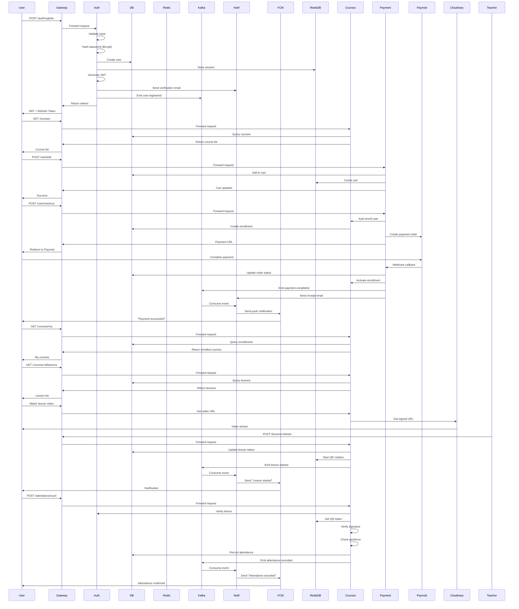
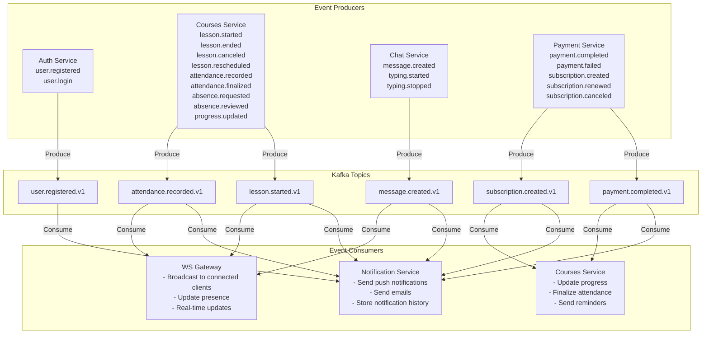
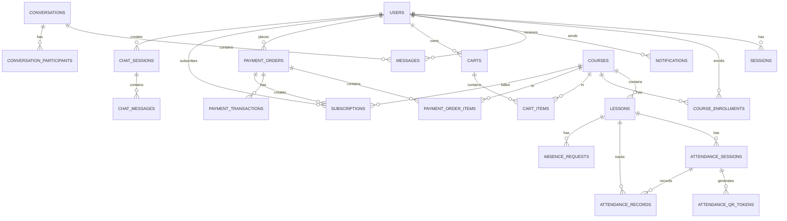
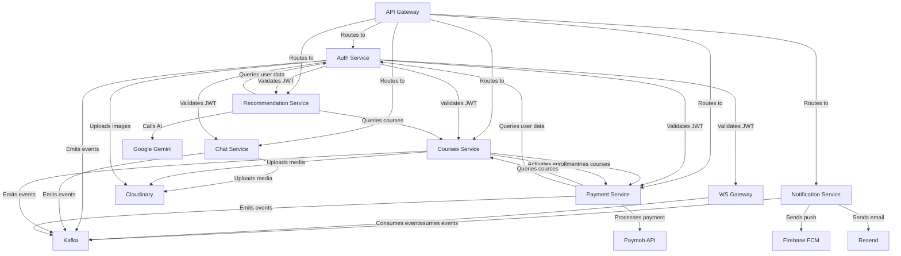
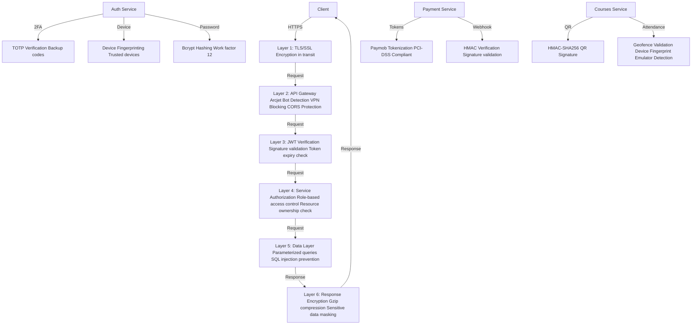
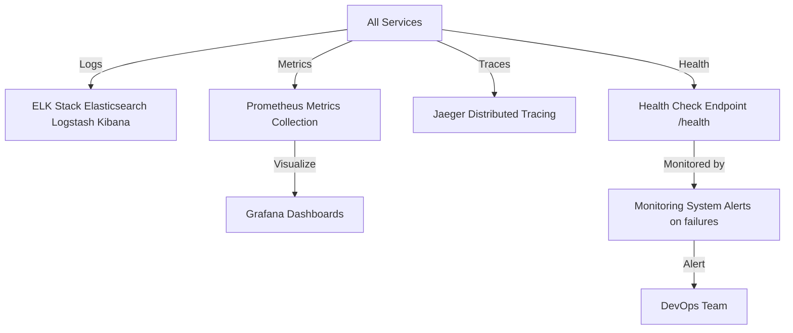
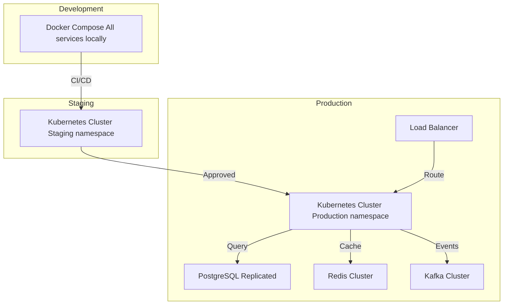

# Integration Guide - All Services Working Together

## SYSTEM OVERVIEW DIAGRAM

```mermaid
graph TB
    subgraph "Client Layer"
        Web["Web Browser"]
        iOS["iOS App"]
        Android["Android App"]
    end
    
    subgraph "API Gateway Layer"
        Gateway["API Gateway<br/>Express.js<br/>Port 6000"]
    end
    
    subgraph "Authentication & Authorization"
        Auth["Auth Service<br/>Node.js + Prisma<br/>Port 6001"]
    end
    
    subgraph "Real-time Communication"
        Chat["Chat Service<br/>Go + Fiber<br/>Ports 6004/14/24"]
        WS["WS Gateway<br/>Go + Fiber<br/>Ports 6005/15/25"]
    end
    
    subgraph "Core Services"
        Courses["Courses Service<br/>Go + Fiber<br/>Ports 8085/86"]
        Payment["Payment Service<br/>Go + Fiber<br/>Port 8090"]
        Notif["Notification Service<br/>Node.js + Firebase<br/>Port 6003"]
        Recommend["Recommendation Svc<br/>Python + FastAPI<br/>Port 8095"]
    end
    
    subgraph "Data Layer"
        DB["PostgreSQL<br/>Port 5432<br/>34 Tables"]
        RedisDB["Redis<br/>Port 6379<br/>Caching & Sessions"]
        Kafka["Kafka<br/>Port 9092<br/>Event Streaming"]
    end
    
    subgraph "External Services"
        FCM["Firebase FCM<br/>Push Notifications"]
        Paymob["Paymob API<br/>Payment Gateway"]
        Resend["Resend<br/>Email Service"]
        Cloudinary["Cloudinary<br/>Media CDN"]
        Gemini["Google Gemini<br/>AI Model"]
        Arcjet["Arcjet<br/>Security"]
    end
    
    Web -->|HTTPS| Gateway
    iOS -->|HTTPS| Gateway
    Android -->|HTTPS| Gateway
    iOS -->|WebSocket| WS
    Android -->|WebSocket| WS
    
    Gateway -->|Route| Auth
    Gateway -->|Route| Notif
    Gateway -->|Route| Chat
    Gateway -->|Route| Courses
    Gateway -->|Route| Payment
    Gateway -->|Route| Recommend
    
    Auth -->|Query/Store| DB
    Chat -->|Query/Store| DB
    Courses -->|Query/Store| DB
    Payment -->|Query/Store| DB
    Notif -->|Query/Store| DB
    Recommend -->|Query/Store| DB
    
    Auth -->|Cache| RedisDB
    Chat -->|Cache| RedisDB
    Courses -->|Cache| RedisDB
    Payment -->|Cache| RedisDB
    Recommend -->|Cache| RedisDB
    WS -->|Pub/Sub| RedisDB
    
    Auth -->|Emit| Kafka
    Chat -->|Emit| Kafka
    Courses -->|Emit| Kafka
    Payment -->|Emit| Kafka
    
    Notif -->|Consume| Kafka
    WS -->|Consume| Kafka
    
    Notif -->|Send| FCM
    Notif -->|Send| Resend
    Payment -->|Send| Resend
    
    Payment -->|Process| Paymob
    
    Chat -->|Upload| Cloudinary
    Courses -->|Upload| Cloudinary
    Auth -->|Upload| Cloudinary
    
    Recommend -->|Call| Gemini
    
    Gateway -->|Security| Arcjet
```



---

## COMPLETE USER JOURNEY - FROM SIGNUP TO COURSE COMPLETION



---

## KAFKA EVENT FLOW - ALL TOPICS



---

## REDIS USAGE ACROSS SERVICES

```mermaid
graph TB
    RedisDB["Redis<br/>Port 6379"]
    
    Auth["Auth Service"]
    Chat["Chat Service"]
    Courses["Courses Service"]
    Payment["Payment Service"]
    Recommend["Recommendation Service"]
    WS["WS Gateway"]
    
    Auth -->|session:{token}| RedisDB
    Auth -->|ratelimit:login:{ip}| RedisDB
    Auth -->|verify:{email}| RedisDB
    Auth -->|reset:{token}| RedisDB
    
    Chat -->|typing:{conv_id}:{user_id}| RedisDB
    Chat -->|presence:user:{user_id}| RedisDB
    Chat -->|messages:{conv_id}:recent| RedisDB
    
    Courses -->|attendance:lesson:{id}:active_qr| RedisDB
    Courses -->|attendance:lesson:{id}:nonce:{nonce}| RedisDB
    Courses -->|attendance:lock:scan:{lesson_id}:{student_id}| RedisDB
    Courses -->|ratelimit:scan:{user_id}| RedisDB
    
    Payment -->|cart:{user_id}| RedisDB
    Payment -->|payment:idempotency:{key}| RedisDB
    Payment -->|subscription:lock:{id}| RedisDB
    
    Recommend -->|recommendation:v1:{user_id}| RedisDB
    Recommend -->|course:{id}| RedisDB
    Recommend -->|trending:courses| RedisDB
    
    WS -->|ws:user:{user_id}:connections| RedisDB
    WS -->|ws:broadcast| RedisDB
    WS -->|ws:user:{user_id}| RedisDB
```

---

## DATABASE RELATIONSHIPS - COMPLETE VIEW



---

## SERVICE DEPENDENCIES & COMMUNICATION



---

## COMPLETE DATA FLOW - PAYMENT TO COURSE ACCESS

```
1. STUDENT ADDS COURSE TO CART
   Student → Gateway → Payment Service
   ↓
   Payment Service:
   - Validates course exists (calls Courses Service)
   - Creates cart item in PostgreSQL
   - Caches cart in Redis
   ↓
   Response: Cart updated

2. STUDENT CHECKS OUT
   Student → Gateway → Payment Service
   ↓
   Payment Service:
   - Validates all courses in cart
   - Calls Courses Service to auto-enroll (unpaid)
   - Creates payment order in PostgreSQL
   - Generates Paymob payment URL
   ↓
   Response: Payment URL

3. STUDENT COMPLETES PAYMENT
   Student → Paymob → Completes payment
   ↓
   Paymob → Webhook → Payment Service
   ↓
   Payment Service:
   - Verifies HMAC signature
   - Updates order status to PAID
   - Calls Courses Service to activate enrollment
   - Creates subscriptions for MONTHLY items
   - Clears cart from Redis
   - Emits Kafka event: payment.completed
   - Sends receipt email via Resend
   ↓
   Kafka Consumer (Notification Service):
   - Receives payment.completed event
   - Creates notification in PostgreSQL
   - Sends push notification via Firebase FCM
   - Sends email confirmation

4. STUDENT ACCESSES COURSE
   Student → Gateway → Courses Service
   ↓
   Courses Service:
   - Validates JWT token (calls Auth Service)
   - Checks enrollment in PostgreSQL
   - Checks is_paid = true
   - Returns course content
   ↓
   Response: Course lessons and materials

5. STUDENT WATCHES LESSON
   Student → Gateway → Courses Service
   ↓
   Courses Service:
   - Validates access
   - Returns video URL from Cloudinary
   ↓
   Student → Cloudinary → Streams video

6. TEACHER STARTS LESSON
   Teacher → Gateway → Courses Service
   ↓
   Courses Service:
   - Updates lesson status to LIVE
   - Starts QR rotation worker
   - Generates QR token every 30 seconds
   - Signs with HMAC-SHA256
   - Stores in Redis with 35s TTL
   - Emits Kafka event: lesson.started
   ↓
   Kafka Consumer (Notification Service):
   - Sends push notification to enrolled students

7. STUDENT SCANS QR CODE
   Student → Gateway → Courses Service
   ↓
   Courses Service:
   - Verifies JWT signature
   - Calls Auth Service to verify device
   - Verifies QR signature
   - Checks geofence (Haversine)
   - Validates device fingerprint
   - Checks for emulator
   - Acquires Redis lock
   - Records attendance in PostgreSQL
   - Emits Kafka event: attendance.recorded
   ↓
   Kafka Consumer (Notification Service):
   - Sends push notification: "Attendance recorded"
   ↓
   Kafka Consumer (WS Gateway):
   - Broadcasts to teacher's connected clients
   ↓
   Response: Attendance confirmed

8. TEACHER ENDS LESSON
   Teacher → Gateway → Courses Service
   ↓
   Courses Service:
   - Updates lesson status to COMPLETED
   - Auto-marks absent students
   - Calculates progress
   - Emits Kafka event: lesson.ended
   ↓
   Kafka Consumer (Notification Service):
   - Sends notifications to students
```

---

## SCALABILITY & LOAD DISTRIBUTION

```mermaid
graph TB
    LB["Load Balancer"]
    
    LB -->|Route| Gateway1["API Gateway Instance 1"]
    LB -->|Route| Gateway2["API Gateway Instance 2"]
    
    Gateway1 -->|Route| Auth["Auth Service Single Instance"]
    Gateway2 -->|Route| Auth
    
    Gateway1 -->|Route| Chat1["Chat Service Instance 1 Port 6004"]
    Gateway1 -->|Route| Chat2["Chat Service Instance 2 Port 6014"]
    Gateway1 -->|Route| Chat3["Chat Service Instance 3 Port 6024"]
    
    Gateway2 -->|Route| Chat1
    Gateway2 -->|Route| Chat2
    Gateway2 -->|Route| Chat3
    
    Gateway1 -->|Route| WS1["WS Gateway Instance 1 Port 6005"]
    Gateway1 -->|Route| WS2["WS Gateway Instance 2 Port 6015"]
    Gateway1 -->|Route| WS3["WS Gateway Instance 3 Port 6025"]
    
    Gateway2 -->|Route| WS1
    Gateway2 -->|Route| WS2
    Gateway2 -->|Route| WS3
    
    Gateway1 -->|Route| Courses1["Courses Service Instance 1 Port 8085"]
    Gateway1 -->|Route| Courses2["Courses Service Instance 2 Port 8086"]
    
    Gateway2 -->|Route| Courses1
    Gateway2 -->|Route| Courses2
    
    Gateway1 -->|Route| Payment["Payment Service Single Instance"]
    Gateway2 -->|Route| Payment
    
    Gateway1 -->|Route| Recommend["Recommendation Service Single Instance"]
    Gateway2 -->|Route| Recommend
    
    Chat1 -->|Shared| DB["PostgreSQL Single Instance"]
    Chat2 -->|Shared| DB
    Chat3 -->|Shared| DB
    
    Chat1 -->|Shared| RedisDB["Redis Single Instance"]
    Chat2 -->|Shared| RedisDB
    Chat3 -->|Shared| RedisDB
    
    Chat1 -->|Shared| Kafka["Kafka Single Instance"]
    Chat2 -->|Shared| Kafka
    Chat3 -->|Shared| Kafka
```



---

## SECURITY LAYERS



---

## MONITORING & OBSERVABILITY



---

## DEPLOYMENT ARCHITECTURE



---

## SUMMARY: HOW EVERYTHING WORKS TOGETHER

1. **Client sends request** → API Gateway
2. **API Gateway** routes to appropriate service
3. **Service validates JWT** with Auth Service
4. **Service queries PostgreSQL** for data
5. **Service caches in Redis** for performance
6. **Service emits Kafka event** for other services
7. **Notification Service consumes event** and sends notifications
8. **WS Gateway consumes event** and broadcasts to connected clients
9. **Response sent back** to client via API Gateway
10. **External services** (FCM, Paymob, Resend, Cloudinary, Gemini) handle specialized tasks

**Result**: A fully integrated, scalable, real-time education platform!
