# Database Schema & Relationships

## COMPLETE DATABASE DIAGRAM

```mermaid
erDiagram
    USERS ||--o{ USER_PREFERENCES : has
    USERS ||--o{ USER_DEVICES : has
    USERS ||--o{ SESSIONS : has
    USERS ||--o{ AUTH_PROVIDERS : has
    USERS ||--o{ LOCATION_HISTORY : has
    USERS ||--o{ PARENT_LINK_REQUESTS : initiates
    USERS ||--o{ PARENT_CHILD_LINKS : parent
    USERS ||--o{ PARENT_CHILD_LINKS : child
    USERS ||--o{ COURSE_ENROLLMENTS : enrolls
    USERS ||--o{ COURSE_RATINGS : rates
    USERS ||--o{ NOTIFICATIONS : receives
    USERS ||--o{ FCM_TOKENS : registers
    USERS ||--o{ CONVERSATIONS : participates
    USERS ||--o{ MESSAGES : sends
    USERS ||--o{ CARTS : owns
    USERS ||--o{ PAYMENT_ORDERS : places
    USERS ||--o{ SUBSCRIPTIONS : subscribes
    USERS ||--o{ RECOMMENDATION_HISTORY : receives
    USERS ||--o{ CHAT_SESSIONS : creates
    
    COURSES ||--o{ LESSONS : contains
    COURSES ||--o{ COURSE_ENROLLMENTS : has
    COURSES ||--o{ COURSE_ASSISTANTS : has
    COURSES ||--o{ COURSE_RATINGS : receives
    COURSES ||--o{ CART_ITEMS : in
    COURSES ||--o{ PAYMENT_ORDER_ITEMS : in
    COURSES ||--o{ SUBSCRIPTIONS : billed
    COURSES ||--o{ PROGRESS_SNAPSHOTS : tracks
    
    LESSONS ||--o{ ATTENDANCE_SESSIONS : has
    LESSONS ||--o{ ATTENDANCE_RECORDS : tracks
    LESSONS ||--o{ ABSENCE_REQUESTS : has
    
    ATTENDANCE_SESSIONS ||--o{ ATTENDANCE_QR_TOKENS : generates
    ATTENDANCE_SESSIONS ||--o{ ATTENDANCE_RECORDS : records
    
    CARTS ||--o{ CART_ITEMS : contains
    
    PAYMENT_ORDERS ||--o{ PAYMENT_ORDER_ITEMS : contains
    PAYMENT_ORDERS ||--o{ PAYMENT_TRANSACTIONS : has
    PAYMENT_ORDERS ||--o{ SUBSCRIPTIONS : creates
    
    CONVERSATIONS ||--o{ MESSAGES : contains
    CONVERSATIONS ||--o{ CONVERSATION_PARTICIPANTS : has
    
    CHAT_SESSIONS ||--o{ CHAT_MESSAGES : contains
```



---

## AUTH SERVICE TABLES

### 1. **users**
```sql
CREATE TABLE users (
    id UUID PRIMARY KEY DEFAULT gen_random_uuid(),
    username VARCHAR(255) UNIQUE NOT NULL,
    email VARCHAR(255) UNIQUE NOT NULL,
    password_hash VARCHAR(255) NOT NULL,
    first_name VARCHAR(255),
    last_name VARCHAR(255),
    bio TEXT,
    profile_image_url VARCHAR(500),
    role VARCHAR(50) NOT NULL, -- STUDENT, TEACHER, PARENT, INSTRUCTOR, ASSISTANT, HR, RECRUITER
    gender VARCHAR(20),
    date_of_birth DATE,
    phone_number VARCHAR(20),
    currency VARCHAR(3) DEFAULT 'EGP',
    is_active BOOLEAN DEFAULT true,
    is_email_verified BOOLEAN DEFAULT false,
    two_fa_enabled BOOLEAN DEFAULT false,
    two_fa_secret VARCHAR(255),
    backup_codes TEXT[], -- JSON array of backup codes
    created_at TIMESTAMPTZ DEFAULT NOW(),
    updated_at TIMESTAMPTZ DEFAULT NOW(),
    deleted_at TIMESTAMPTZ
);

CREATE INDEX idx_users_username ON users(username);
CREATE INDEX idx_users_email ON users(email);
CREATE INDEX idx_users_role ON users(role);
```

### 2. **user_preferences**
```sql
CREATE TABLE user_preferences (
    id UUID PRIMARY KEY DEFAULT gen_random_uuid(),
    user_id UUID NOT NULL UNIQUE REFERENCES users(id) ON DELETE CASCADE,
    language VARCHAR(10) DEFAULT 'en', -- en, ar, fr
    theme VARCHAR(20) DEFAULT 'light', -- light, dark
    notifications_enabled BOOLEAN DEFAULT true,
    email_notifications BOOLEAN DEFAULT true,
    push_notifications BOOLEAN DEFAULT true,
    created_at TIMESTAMPTZ DEFAULT NOW(),
    updated_at TIMESTAMPTZ DEFAULT NOW()
);
```

### 3. **user_devices**
```sql
CREATE TABLE user_devices (
    id UUID PRIMARY KEY DEFAULT gen_random_uuid(),
    user_id UUID NOT NULL REFERENCES users(id) ON DELETE CASCADE,
    device_id VARCHAR(255) NOT NULL,
    device_fingerprint VARCHAR(255) NOT NULL,
    device_name VARCHAR(255),
    platform VARCHAR(50), -- iOS, Android, Web
    os_version VARCHAR(50),
    app_version VARCHAR(50),
    is_trusted BOOLEAN DEFAULT false,
    last_used_at TIMESTAMPTZ,
    created_at TIMESTAMPTZ DEFAULT NOW(),
    updated_at TIMESTAMPTZ DEFAULT NOW(),
    
    UNIQUE(user_id, device_fingerprint)
);

CREATE INDEX idx_user_devices_user_id ON user_devices(user_id);
```

### 4. **sessions**
```sql
CREATE TABLE sessions (
    id UUID PRIMARY KEY DEFAULT gen_random_uuid(),
    user_id UUID NOT NULL REFERENCES users(id) ON DELETE CASCADE,
    device_id UUID NOT NULL REFERENCES user_devices(id) ON DELETE CASCADE,
    access_token VARCHAR(1000) NOT NULL,
    refresh_token VARCHAR(1000) NOT NULL,
    ip_address VARCHAR(45),
    user_agent TEXT,
    location_lat DECIMAL(10, 8),
    location_lng DECIMAL(11, 8),
    is_active BOOLEAN DEFAULT true,
    is_revoked BOOLEAN DEFAULT false,
    expires_at TIMESTAMPTZ NOT NULL,
    created_at TIMESTAMPTZ DEFAULT NOW(),
    updated_at TIMESTAMPTZ DEFAULT NOW(),
    
    UNIQUE(access_token),
    UNIQUE(refresh_token)
);

CREATE INDEX idx_sessions_user_active ON sessions(user_id, is_active, is_revoked, expires_at);
CREATE INDEX idx_sessions_expires_at ON sessions(expires_at);
```

### 5. **auth_providers**
```sql
CREATE TABLE auth_providers (
    id UUID PRIMARY KEY DEFAULT gen_random_uuid(),
    user_id UUID NOT NULL REFERENCES users(id) ON DELETE CASCADE,
    provider VARCHAR(50) NOT NULL, -- google, apple
    provider_user_id VARCHAR(255) NOT NULL,
    provider_email VARCHAR(255),
    created_at TIMESTAMPTZ DEFAULT NOW(),
    
    UNIQUE(provider, provider_user_id)
);
```

### 6. **location_history**
```sql
CREATE TABLE location_history (
    id UUID PRIMARY KEY DEFAULT gen_random_uuid(),
    user_id UUID NOT NULL REFERENCES users(id) ON DELETE CASCADE,
    latitude DECIMAL(10, 8) NOT NULL,
    longitude DECIMAL(11, 8) NOT NULL,
    accuracy DECIMAL(10, 2),
    created_at TIMESTAMPTZ DEFAULT NOW(),
    
    INDEX idx_location_user_time (user_id, created_at)
);
```

### 7. **parent_link_requests**
```sql
CREATE TABLE parent_link_requests (
    id UUID PRIMARY KEY DEFAULT gen_random_uuid(),
    parent_id UUID NOT NULL REFERENCES users(id) ON DELETE CASCADE,
    child_id UUID NOT NULL REFERENCES users(id) ON DELETE CASCADE,
    status VARCHAR(50) DEFAULT 'PENDING', -- PENDING, APPROVED, REJECTED
    created_at TIMESTAMPTZ DEFAULT NOW(),
    responded_at TIMESTAMPTZ,
    
    UNIQUE(parent_id, child_id)
);

CREATE INDEX idx_parent_link_requests_child ON parent_link_requests(child_id, status);
```

### 8. **parent_child_links**
```sql
CREATE TABLE parent_child_links (
    id UUID PRIMARY KEY DEFAULT gen_random_uuid(),
    parent_id UUID NOT NULL REFERENCES users(id) ON DELETE CASCADE,
    child_id UUID NOT NULL REFERENCES users(id) ON DELETE CASCADE,
    created_at TIMESTAMPTZ DEFAULT NOW(),
    
    UNIQUE(parent_id, child_id)
);

CREATE INDEX idx_parent_child_links_parent ON parent_child_links(parent_id);
CREATE INDEX idx_parent_child_links_child ON parent_child_links(child_id);
```

---

## NOTIFICATION SERVICE TABLES

### 9. **notifications**
```sql
CREATE TABLE notifications (
    id UUID PRIMARY KEY DEFAULT gen_random_uuid(),
    user_id UUID NOT NULL REFERENCES users(id) ON DELETE CASCADE,
    type VARCHAR(100) NOT NULL, -- parent_link_request, course_enrolled, payment_completed, etc.
    title VARCHAR(255),
    message TEXT,
    data JSONB, -- Additional data (requestId, courseId, etc.)
    is_read BOOLEAN DEFAULT false,
    read_at TIMESTAMPTZ,
    created_at TIMESTAMPTZ DEFAULT NOW(),
    
    INDEX idx_notifications_user_read (user_id, is_read, created_at)
);
```

### 10. **fcm_tokens**
```sql
CREATE TABLE fcm_tokens (
    id UUID PRIMARY KEY DEFAULT gen_random_uuid(),
    user_id UUID NOT NULL REFERENCES users(id) ON DELETE CASCADE,
    token VARCHAR(500) NOT NULL UNIQUE,
    device_id VARCHAR(255),
    platform VARCHAR(50), -- ios, android
    is_active BOOLEAN DEFAULT true,
    created_at TIMESTAMPTZ DEFAULT NOW(),
    updated_at TIMESTAMPTZ DEFAULT NOW(),
    
    INDEX idx_fcm_tokens_user ON user_id
);
```

---

## COURSES SERVICE TABLES

### 11. **subjects**
```sql
CREATE TABLE subjects (
    id UUID PRIMARY KEY DEFAULT gen_random_uuid(),
    name VARCHAR(255) NOT NULL UNIQUE,
    description TEXT,
    created_at TIMESTAMPTZ DEFAULT NOW()
);
```

### 12. **courses**
```sql
CREATE TABLE courses (
    id UUID PRIMARY KEY DEFAULT gen_random_uuid(),
    teacher_id UUID NOT NULL REFERENCES users(id) ON DELETE CASCADE,
    subject_id UUID NOT NULL REFERENCES subjects(id),
    title VARCHAR(255) NOT NULL,
    description TEXT,
    delivery_type VARCHAR(50) NOT NULL, -- ONLINE, OFFLINE
    location_name VARCHAR(255),
    location_lat DECIMAL(10, 8),
    location_lng DECIMAL(11, 8),
    geofence_radius_m INTEGER DEFAULT 100,
    total_lessons INTEGER,
    price DECIMAL(10, 2),
    currency VARCHAR(3) DEFAULT 'EGP',
    is_paid BOOLEAN DEFAULT false,
    billing_type VARCHAR(50), -- ONE_TIME, MONTHLY
    free_trial_lessons INTEGER DEFAULT 0,
    course_image_url VARCHAR(500),
    attendance_weight DECIMAL(3, 2) DEFAULT 0.30,
    status VARCHAR(50) DEFAULT 'ACTIVE', -- ACTIVE, PAUSED, ARCHIVED
    created_at TIMESTAMPTZ DEFAULT NOW(),
    updated_at TIMESTAMPTZ DEFAULT NOW(),
    
    INDEX idx_courses_teacher ON teacher_id,
    INDEX idx_courses_subject ON subject_id,
    INDEX idx_courses_status ON status
);
```

### 13. **lessons**
```sql
CREATE TABLE lessons (
    id UUID PRIMARY KEY DEFAULT gen_random_uuid(),
    course_id UUID NOT NULL REFERENCES courses(id) ON DELETE CASCADE,
    title VARCHAR(255) NOT NULL,
    description TEXT,
    lesson_number INTEGER,
    delivery_type VARCHAR(50), -- ONLINE, OFFLINE
    status VARCHAR(50) DEFAULT 'SCHEDULED', -- SCHEDULED, LIVE, COMPLETED, CANCELED
    scheduled_at TIMESTAMPTZ NOT NULL,
    duration_minutes INTEGER,
    is_free BOOLEAN DEFAULT false,
    video_url VARCHAR(500),
    video_public_id VARCHAR(255),
    materials_url VARCHAR(500),
    created_at TIMESTAMPTZ DEFAULT NOW(),
    updated_at TIMESTAMPTZ DEFAULT NOW(),
    
    INDEX idx_lessons_course_status ON course_id, status,
    INDEX idx_lessons_scheduled_at ON scheduled_at
);
```

### 14. **course_enrollments**
```sql
CREATE TABLE course_enrollments (
    id UUID PRIMARY KEY DEFAULT gen_random_uuid(),
    course_id UUID NOT NULL REFERENCES courses(id) ON DELETE CASCADE,
    user_id UUID NOT NULL REFERENCES users(id) ON DELETE CASCADE,
    is_paid BOOLEAN DEFAULT false,
    paid_at TIMESTAMPTZ,
    is_active BOOLEAN DEFAULT true,
    enrolled_at TIMESTAMPTZ DEFAULT NOW(),
    
    UNIQUE(course_id, user_id),
    INDEX idx_enrollments_user_course ON user_id, course_id
);
```

### 15. **course_assistants**
```sql
CREATE TABLE course_assistants (
    id UUID PRIMARY KEY DEFAULT gen_random_uuid(),
    course_id UUID NOT NULL REFERENCES courses(id) ON DELETE CASCADE,
    assistant_id UUID NOT NULL REFERENCES users(id) ON DELETE CASCADE,
    can_start_lesson BOOLEAN DEFAULT false,
    can_end_lesson BOOLEAN DEFAULT false,
    can_view_attendance BOOLEAN DEFAULT false,
    can_edit_attendance BOOLEAN DEFAULT false,
    created_at TIMESTAMPTZ DEFAULT NOW(),
    
    UNIQUE(course_id, assistant_id)
);
```

### 16. **course_ratings**
```sql
CREATE TABLE course_ratings (
    id UUID PRIMARY KEY DEFAULT gen_random_uuid(),
    course_id UUID NOT NULL REFERENCES courses(id) ON DELETE CASCADE,
    user_id UUID NOT NULL REFERENCES users(id) ON DELETE CASCADE,
    rating DECIMAL(3, 1) NOT NULL, -- 1.0 to 5.0
    review TEXT,
    created_at TIMESTAMPTZ DEFAULT NOW(),
    updated_at TIMESTAMPTZ DEFAULT NOW(),
    
    UNIQUE(course_id, user_id)
);
```

### 17. **attendance_sessions**
```sql
CREATE TABLE attendance_sessions (
    id UUID PRIMARY KEY DEFAULT gen_random_uuid(),
    lesson_id UUID NOT NULL REFERENCES lessons(id) ON DELETE CASCADE,
    qr_rotation_seconds INTEGER DEFAULT 30,
    qr_expiry_seconds INTEGER DEFAULT 35,
    started_at TIMESTAMPTZ DEFAULT NOW(),
    ended_at TIMESTAMPTZ,
    
    UNIQUE(lesson_id)
);
```

### 18. **attendance_qr_tokens**
```sql
CREATE TABLE attendance_qr_tokens (
    id UUID PRIMARY KEY DEFAULT gen_random_uuid(),
    lesson_id UUID NOT NULL REFERENCES lessons(id) ON DELETE CASCADE,
    nonce VARCHAR(255) NOT NULL,
    payload TEXT NOT NULL,
    signature VARCHAR(255) NOT NULL,
    issued_at TIMESTAMPTZ DEFAULT NOW(),
    expires_at TIMESTAMPTZ NOT NULL,
    is_used BOOLEAN DEFAULT false,
    
    UNIQUE(lesson_id, nonce),
    INDEX idx_qr_tokens_expires ON expires_at
);
```

### 19. **attendance_records**
```sql
CREATE TABLE attendance_records (
    id UUID PRIMARY KEY DEFAULT gen_random_uuid(),
    lesson_id UUID NOT NULL REFERENCES lessons(id) ON DELETE CASCADE,
    student_id UUID NOT NULL REFERENCES users(id) ON DELETE CASCADE,
    status VARCHAR(50) NOT NULL, -- PRESENT, LATE, ABSENT, EXCUSED
    scan_time TIMESTAMPTZ,
    device_id VARCHAR(255),
    latitude DECIMAL(10, 8),
    longitude DECIMAL(11, 8),
    created_at TIMESTAMPTZ DEFAULT NOW(),
    updated_at TIMESTAMPTZ DEFAULT NOW(),
    
    UNIQUE(lesson_id, student_id),
    INDEX idx_attendance_lesson_student ON lesson_id, student_id,
    INDEX idx_attendance_student ON student_id
);
```

### 20. **absence_requests**
```sql
CREATE TABLE absence_requests (
    id UUID PRIMARY KEY DEFAULT gen_random_uuid(),
    lesson_id UUID NOT NULL REFERENCES lessons(id) ON DELETE CASCADE,
    student_id UUID NOT NULL REFERENCES users(id) ON DELETE CASCADE,
    reason_type VARCHAR(50) NOT NULL, -- PARENT_EXCUSE, MEDICAL, EMERGENCY
    reason_text TEXT,
    status VARCHAR(50) DEFAULT 'PENDING', -- PENDING, APPROVED, REJECTED
    reviewed_by UUID REFERENCES users(id),
    reviewed_at TIMESTAMPTZ,
    created_at TIMESTAMPTZ DEFAULT NOW(),
    
    INDEX idx_absence_requests_student ON student_id,
    INDEX idx_absence_requests_status ON status
);
```

### 21. **progress_snapshots**
```sql
CREATE TABLE progress_snapshots (
    id UUID PRIMARY KEY DEFAULT gen_random_uuid(),
    course_id UUID NOT NULL REFERENCES courses(id) ON DELETE CASCADE,
    student_id UUID NOT NULL REFERENCES users(id) ON DELETE CASCADE,
    total_lessons INTEGER,
    completed_lessons INTEGER,
    attendance_points DECIMAL(10, 2),
    completion_ratio DECIMAL(5, 2),
    attendance_ratio DECIMAL(5, 2),
    overall_progress DECIMAL(5, 2),
    updated_at TIMESTAMPTZ DEFAULT NOW(),
    
    UNIQUE(course_id, student_id),
    INDEX idx_progress_student ON student_id
);
```

---

## CHAT SERVICE TABLES

### 22. **conversations**
```sql
CREATE TABLE conversations (
    id UUID PRIMARY KEY DEFAULT gen_random_uuid(),
    type VARCHAR(50) NOT NULL, -- DIRECT, GROUP
    title VARCHAR(255),
    created_by UUID NOT NULL REFERENCES users(id),
    created_at TIMESTAMPTZ DEFAULT NOW(),
    updated_at TIMESTAMPTZ DEFAULT NOW(),
    
    INDEX idx_conversations_created_by ON created_by
);
```

### 23. **conversation_participants**
```sql
CREATE TABLE conversation_participants (
    id UUID PRIMARY KEY DEFAULT gen_random_uuid(),
    conversation_id UUID NOT NULL REFERENCES conversations(id) ON DELETE CASCADE,
    user_id UUID NOT NULL REFERENCES users(id) ON DELETE CASCADE,
    unread_count INTEGER DEFAULT 0,
    joined_at TIMESTAMPTZ DEFAULT NOW(),
    
    UNIQUE(conversation_id, user_id),
    INDEX idx_participants_user ON user_id
);
```

### 24. **messages**
```sql
CREATE TABLE messages (
    id UUID PRIMARY KEY DEFAULT gen_random_uuid(),
    conversation_id UUID NOT NULL REFERENCES conversations(id) ON DELETE CASCADE,
    sender_id UUID NOT NULL REFERENCES users(id) ON DELETE CASCADE,
    content TEXT NOT NULL,
    media_url VARCHAR(500),
    media_type VARCHAR(50), -- image, video, document
    is_edited BOOLEAN DEFAULT false,
    edited_at TIMESTAMPTZ,
    created_at TIMESTAMPTZ DEFAULT NOW(),
    
    INDEX idx_messages_conversation ON conversation_id, created_at,
    INDEX idx_messages_sender ON sender_id
);
```

---

## PAYMENT SERVICE TABLES

### 25. **carts**
```sql
CREATE TABLE carts (
    id UUID PRIMARY KEY DEFAULT gen_random_uuid(),
    user_id UUID NOT NULL UNIQUE REFERENCES users(id) ON DELETE CASCADE,
    created_at TIMESTAMPTZ DEFAULT NOW(),
    updated_at TIMESTAMPTZ DEFAULT NOW()
);
```

### 26. **cart_items**
```sql
CREATE TABLE cart_items (
    id UUID PRIMARY KEY DEFAULT gen_random_uuid(),
    cart_id UUID NOT NULL REFERENCES carts(id) ON DELETE CASCADE,
    course_id UUID NOT NULL REFERENCES courses(id) ON DELETE CASCADE,
    billing_type VARCHAR(50) NOT NULL, -- ONE_TIME, MONTHLY
    price_cents BIGINT NOT NULL,
    currency VARCHAR(3) DEFAULT 'EGP',
    added_at TIMESTAMPTZ DEFAULT NOW(),
    
    UNIQUE(cart_id, course_id)
);
```

### 27. **payment_orders**
```sql
CREATE TABLE payment_orders (
    id UUID PRIMARY KEY DEFAULT gen_random_uuid(),
    user_id UUID NOT NULL REFERENCES users(id) ON DELETE CASCADE,
    order_type VARCHAR(50) NOT NULL, -- SINGLE_COURSE, CART_CHECKOUT, SUBSCRIPTION_RENEWAL
    total_cents BIGINT NOT NULL,
    currency VARCHAR(3) DEFAULT 'EGP',
    status VARCHAR(50) DEFAULT 'PENDING', -- PENDING, PAID, FAILED, CANCELED
    subscription_id UUID REFERENCES subscriptions(id),
    payment_method_id UUID REFERENCES payment_methods(id),
    is_auto_charge BOOLEAN DEFAULT false,
    created_at TIMESTAMPTZ DEFAULT NOW(),
    updated_at TIMESTAMPTZ DEFAULT NOW(),
    
    INDEX idx_orders_user_status ON user_id, status,
    INDEX idx_orders_created_at ON created_at
);
```

### 28. **payment_order_items**
```sql
CREATE TABLE payment_order_items (
    id UUID PRIMARY KEY DEFAULT gen_random_uuid(),
    order_id UUID NOT NULL REFERENCES payment_orders(id) ON DELETE CASCADE,
    course_id UUID NOT NULL REFERENCES courses(id),
    billing_type VARCHAR(50) NOT NULL, -- ONE_TIME, MONTHLY
    price_cents BIGINT NOT NULL,
    currency VARCHAR(3) DEFAULT 'EGP'
);
```

### 29. **payment_transactions**
```sql
CREATE TABLE payment_transactions (
    id UUID PRIMARY KEY DEFAULT gen_random_uuid(),
    order_id UUID NOT NULL REFERENCES payment_orders(id) ON DELETE CASCADE,
    paymob_transaction_id VARCHAR(255) UNIQUE,
    status VARCHAR(50) NOT NULL, -- SUCCESS, FAILED, PENDING
    payment_method VARCHAR(50), -- CARD, WALLET
    amount_cents BIGINT,
    currency VARCHAR(3),
    response_data JSONB,
    created_at TIMESTAMPTZ DEFAULT NOW(),
    
    INDEX idx_transactions_order ON order_id
);
```

### 30. **subscriptions**
```sql
CREATE TABLE subscriptions (
    id UUID PRIMARY KEY DEFAULT gen_random_uuid(),
    user_id UUID NOT NULL REFERENCES users(id) ON DELETE CASCADE,
    course_id UUID NOT NULL REFERENCES courses(id),
    status VARCHAR(50) DEFAULT 'ACTIVE', -- ACTIVE, CANCELLED, SUSPENDED, EXPIRED
    price_cents BIGINT NOT NULL,
    currency VARCHAR(3) DEFAULT 'EGP',
    billing_cycle_months INTEGER DEFAULT 1,
    next_billing_date TIMESTAMPTZ NOT NULL,
    last_billing_date TIMESTAMPTZ,
    started_at TIMESTAMPTZ DEFAULT NOW(),
    cancelled_at TIMESTAMPTZ,
    created_at TIMESTAMPTZ DEFAULT NOW(),
    updated_at TIMESTAMPTZ DEFAULT NOW(),
    
    INDEX idx_subscriptions_user_status ON user_id, status,
    INDEX idx_subscriptions_billing_date ON next_billing_date
);
```

### 31. **payment_methods**
```sql
CREATE TABLE payment_methods (
    id UUID PRIMARY KEY DEFAULT gen_random_uuid(),
    user_id UUID NOT NULL REFERENCES users(id) ON DELETE CASCADE,
    token VARCHAR(255) NOT NULL, -- Paymob token
    last_four VARCHAR(4),
    card_brand VARCHAR(50), -- Visa, Mastercard
    is_default BOOLEAN DEFAULT false,
    created_at TIMESTAMPTZ DEFAULT NOW(),
    
    INDEX idx_payment_methods_user ON user_id
);
```

---

## RECOMMENDATION SERVICE TABLES

### 32. **recommendation_history**
```sql
CREATE TABLE recommendation_history (
    id UUID PRIMARY KEY DEFAULT gen_random_uuid(),
    user_id UUID NOT NULL REFERENCES users(id) ON DELETE CASCADE,
    course_id UUID NOT NULL REFERENCES courses(id),
    score DECIMAL(5, 2),
    reason VARCHAR(255),
    created_at TIMESTAMPTZ DEFAULT NOW(),
    
    INDEX idx_recommendation_user ON user_id, created_at
);
```

### 33. **chat_sessions**
```sql
CREATE TABLE chat_sessions (
    id UUID PRIMARY KEY DEFAULT gen_random_uuid(),
    user_id UUID NOT NULL REFERENCES users(id) ON DELETE CASCADE,
    title VARCHAR(255),
    is_active BOOLEAN DEFAULT true,
    created_at TIMESTAMPTZ DEFAULT NOW(),
    updated_at TIMESTAMPTZ DEFAULT NOW(),
    
    INDEX idx_chat_sessions_user ON user_id
);
```

### 34. **chat_messages**
```sql
CREATE TABLE chat_messages (
    id UUID PRIMARY KEY DEFAULT gen_random_uuid(),
    session_id UUID NOT NULL REFERENCES chat_sessions(id) ON DELETE CASCADE,
    role VARCHAR(50) NOT NULL, -- user, assistant
    content TEXT NOT NULL,
    media_url VARCHAR(500),
    created_at TIMESTAMPTZ DEFAULT NOW(),
    
    INDEX idx_chat_messages_session ON session_id, created_at
);
```

---

## KEY RELATIONSHIPS SUMMARY

```
┌─────────────────────────────────────────────────────────────┐
│                    RELATIONSHIP DIAGRAM                      │
└─────────────────────────────────────────────────────────────┘

USERS (Central Hub)
├── 1:1 → USER_PREFERENCES
├── 1:N → USER_DEVICES
├── 1:N → SESSIONS
├── 1:N → AUTH_PROVIDERS
├── 1:N → LOCATION_HISTORY
├── 1:N → PARENT_LINK_REQUESTS (as parent)
├── 1:N → PARENT_CHILD_LINKS (as parent/child)
├── 1:N → COURSE_ENROLLMENTS
├── 1:N → COURSE_RATINGS
├── 1:N → NOTIFICATIONS
├── 1:N → FCM_TOKENS
├── 1:N → CONVERSATIONS
├── 1:N → MESSAGES
├── 1:N → CARTS
├── 1:N → PAYMENT_ORDERS
├── 1:N → SUBSCRIPTIONS
├── 1:N → RECOMMENDATION_HISTORY
└── 1:N → CHAT_SESSIONS

COURSES
├── 1:N → LESSONS
├── 1:N → COURSE_ENROLLMENTS
├── 1:N → COURSE_ASSISTANTS
├── 1:N → COURSE_RATINGS
├── 1:N → CART_ITEMS
├── 1:N → PAYMENT_ORDER_ITEMS
├── 1:N → SUBSCRIPTIONS
└── 1:N → PROGRESS_SNAPSHOTS

LESSONS
├── 1:1 → ATTENDANCE_SESSIONS
├── 1:N → ATTENDANCE_RECORDS
└── 1:N → ABSENCE_REQUESTS

ATTENDANCE_SESSIONS
├── 1:N → ATTENDANCE_QR_TOKENS
└── 1:N → ATTENDANCE_RECORDS

CARTS
└── 1:N → CART_ITEMS

PAYMENT_ORDERS
├── 1:N → PAYMENT_ORDER_ITEMS
├── 1:N → PAYMENT_TRANSACTIONS
└── 1:N → SUBSCRIPTIONS

CONVERSATIONS
├── 1:N → CONVERSATION_PARTICIPANTS
└── 1:N → MESSAGES

CHAT_SESSIONS
└── 1:N → CHAT_MESSAGES
```

---

## INDEXES FOR PERFORMANCE

```sql
-- Auth Service Indexes
CREATE INDEX idx_users_username ON users(username);
CREATE INDEX idx_users_email ON users(email);
CREATE INDEX idx_sessions_user_active ON sessions(user_id, is_active, is_revoked, expires_at);
CREATE INDEX idx_sessions_expires_at ON sessions(expires_at);

-- Courses Service Indexes
CREATE INDEX idx_courses_teacher ON courses(teacher_id);
CREATE INDEX idx_courses_subject ON courses(subject_id);
CREATE INDEX idx_lessons_course_status ON lessons(course_id, status);
CREATE INDEX idx_enrollments_user_course ON course_enrollments(user_id, course_id);
CREATE INDEX idx_attendance_lesson_student ON attendance_records(lesson_id, student_id);
CREATE INDEX idx_attendance_student ON attendance_records(student_id);
CREATE INDEX idx_progress_student ON progress_snapshots(student_id);

-- Chat Service Indexes
CREATE INDEX idx_messages_conversation ON messages(conversation_id, created_at);
CREATE INDEX idx_participants_user ON conversation_participants(user_id);

-- Payment Service Indexes
CREATE INDEX idx_orders_user_status ON payment_orders(user_id, status);
CREATE INDEX idx_subscriptions_user_status ON subscriptions(user_id, status);
CREATE INDEX idx_subscriptions_billing_date ON subscriptions(next_billing_date);

-- Notification Service Indexes
CREATE INDEX idx_notifications_user_read ON notifications(user_id, is_read, created_at);

-- Recommendation Service Indexes
CREATE INDEX idx_recommendation_user ON recommendation_history(user_id, created_at);
CREATE INDEX idx_chat_sessions_user ON chat_sessions(user_id);
CREATE INDEX idx_chat_messages_session ON chat_messages(session_id, created_at);
```

---

## CONSTRAINTS & UNIQUENESS

```
UNIQUE CONSTRAINTS:
- users(username)
- users(email)
- user_preferences(user_id)
- user_devices(user_id, device_fingerprint)
- sessions(access_token)
- sessions(refresh_token)
- auth_providers(provider, provider_user_id)
- parent_link_requests(parent_id, child_id)
- parent_child_links(parent_id, child_id)
- fcm_tokens(token)
- courses_enrollments(course_id, user_id)
- course_assistants(course_id, assistant_id)
- course_ratings(course_id, user_id)
- attendance_sessions(lesson_id)
- attendance_qr_tokens(lesson_id, nonce)
- attendance_records(lesson_id, student_id)
- cart_items(cart_id, course_id)
- payment_transactions(paymob_transaction_id)
- payment_methods(user_id, token)
- subscriptions(user_id, course_id)
- conversation_participants(conversation_id, user_id)
- recommendation_history(user_id, course_id)
```

---

## FOREIGN KEY RELATIONSHIPS

```
All foreign keys use:
- ON DELETE CASCADE (for dependent records)
- ON UPDATE CASCADE (for referential integrity)

Example:
- When a user is deleted, all their sessions, enrollments, messages are deleted
- When a course is deleted, all lessons, enrollments, ratings are deleted
- When a lesson is deleted, all attendance records are deleted
```

