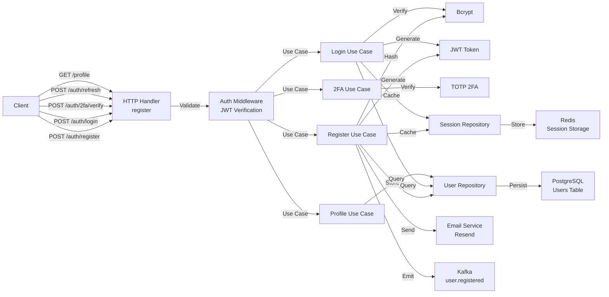
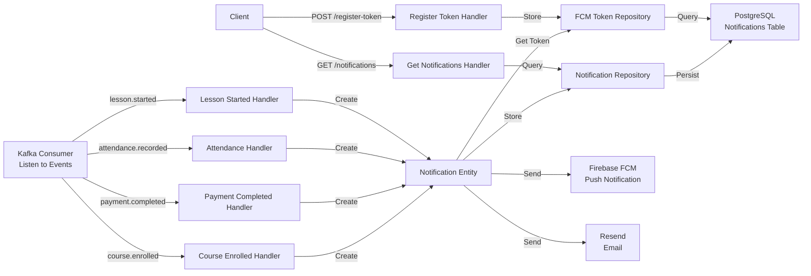
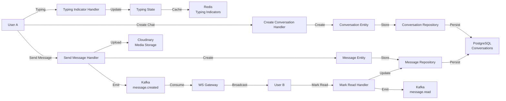
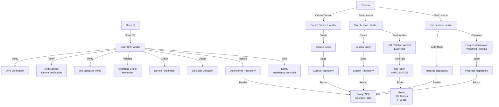
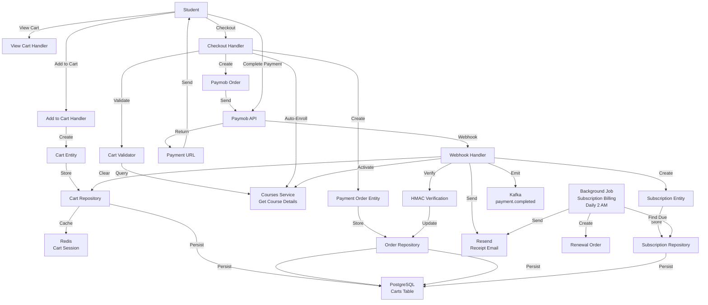
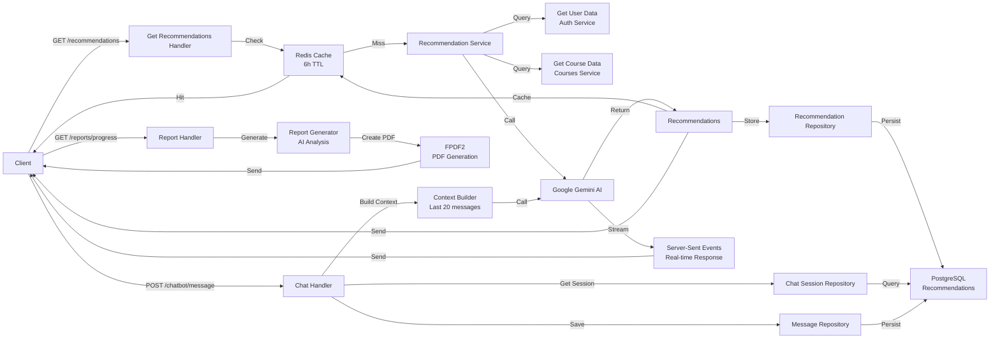
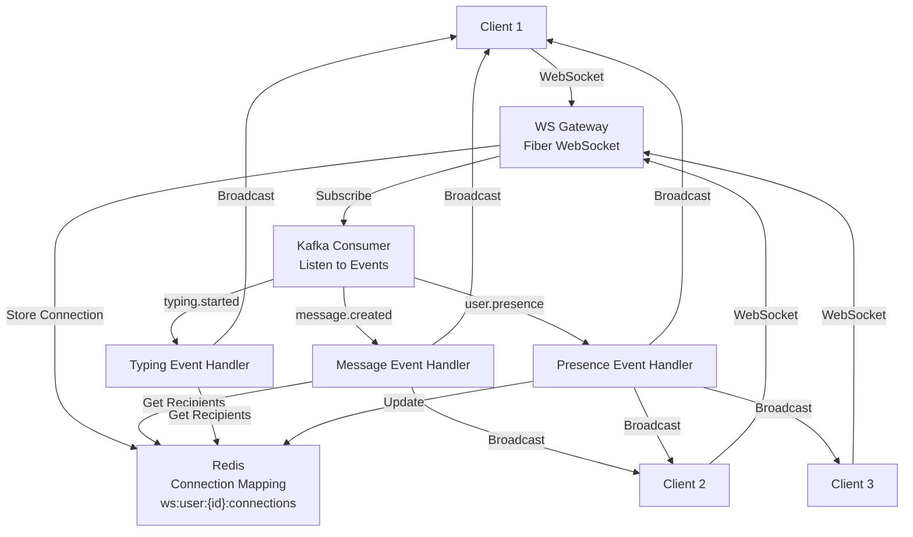
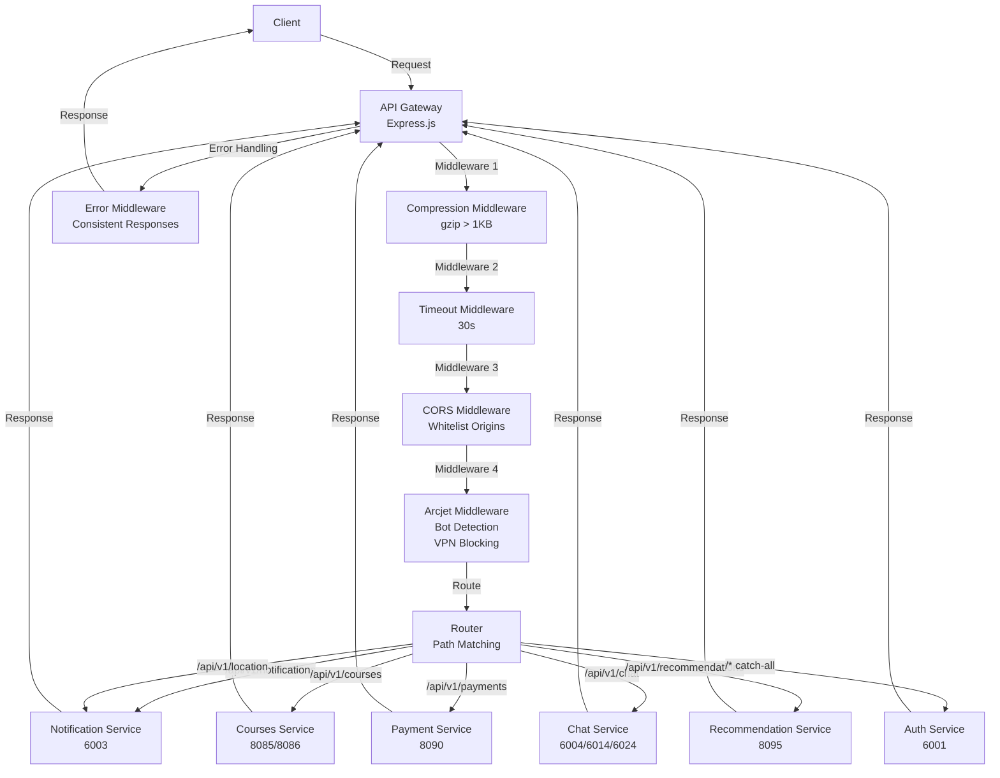
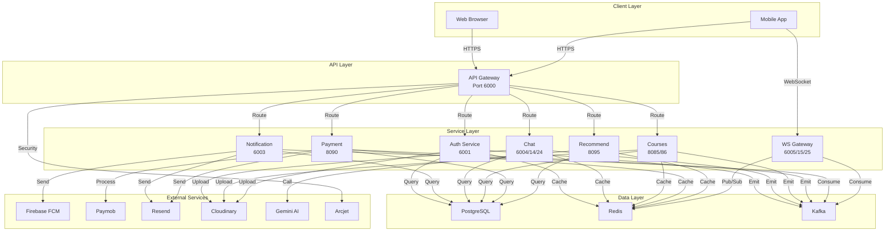

# Mermaid Diagrams - Services & Database Architecture

## 1. OVERALL SYSTEM ARCHITECTURE

```mermaid
graph TB
    Client["Client Applications<br/>(Web, iOS, Android)"]
    
    Client -->|HTTPS| Gateway["API Gateway<br/>Port 6000<br/>Node.js + Express"]
    
    Gateway -->|Route| Auth["Auth Service<br/>Port 6001<br/>Node.js + Prisma"]
    Gateway -->|Route| Notif["Notification Service<br/>Port 6003<br/>Node.js + Firebase"]
    Gateway -->|Route| Chat["Chat Service<br/>Ports 6004/14/24<br/>Go + Fiber (3x)"]
    Gateway -->|Route| Courses["Courses Service<br/>Ports 8085/86<br/>Go + Fiber (2x)"]
    Gateway -->|Route| Payment["Payment Service<br/>Port 8090<br/>Go + Fiber"]
    Gateway -->|Route| Recommend["Recommendation Svc<br/>Port 8095<br/>Python + FastAPI"]
    
    WS["WS Gateway<br/>Ports 6005/15/25<br/>Go + Fiber (3x)"]
    Client -->|WebSocket| WS
    
    Auth -->|Query/Store| DB["PostgreSQL<br/>Port 5432"]
    Notif -->|Query/Store| DB
    Chat -->|Query/Store| DB
    Courses -->|Query/Store| DB
    Payment -->|Query/Store| DB
    Recommend -->|Query/Store| DB
    
    Auth -->|Cache/Session| Redis["Redis<br/>Port 6379"]
    Chat -->|Cache| Redis
    Courses -->|QR Tokens| Redis
    Payment -->|Cart| Redis
    Recommend -->|Cache| Redis
    WS -->|Pub/Sub| Redis
    
    Auth -->|Events| Kafka["Kafka<br/>Port 9092"]
    Notif -->|Consume| Kafka
    Chat -->|Events| Kafka
    Courses -->|Events| Kafka
    Payment -->|Events| Kafka
    WS -->|Consume| Kafka
    
    Notif -->|Push| FCM["Firebase FCM"]
    Notif -->|Email| Resend["Resend"]
    Payment -->|Email| Resend
    
    Payment -->|Process| Paymob["Paymob API"]
    
    Chat -->|Media| Cloudinary["Cloudinary CDN"]
    Courses -->|Media| Cloudinary
    Auth -->|Images| Cloudinary
    
    Recommend -->|AI| Gemini["Google Gemini AI"]
    
    Gateway -->|Security| Arcjet["Arcjet<br/>Bot Detection"]

    subgraph "Observability & Monitoring"
        Prometheus["Prometheus<br/>Port 9090"]
        Grafana["Grafana<br/>Port 3001"]
        Loki["Loki<br/>Port 3100"]
        Jaeger["Jaeger<br/>Port 16686"]
        OTel["OTel Collector<br/>Port 4318"]
        Sentry["Sentry<br/>Cloud"]
    end
    
    Prometheus -->|Scrape Metrics| Gateway
    Prometheus -->|Scrape Metrics| Auth
    Prometheus -->|Scrape Metrics| Chat
    Prometheus -->|Scrape Metrics| Courses
    Prometheus -->|Scrape Metrics| Payment
    Prometheus -->|Scrape Metrics| Recommend
    
    Gateway -->|Send Traces| OTel
    Auth -->|Send Traces| OTel
    Chat -->|Send Traces| OTel
    Courses -->|Send Traces| OTel
    Payment -->|Send Traces| OTel
    Recommend -->|Send Traces| OTel
    
    OTel -->|Export Traces| Jaeger
    Grafana -->|Query| Prometheus
    Grafana -->|Query| Loki
    
    Gateway -->|Report Errors| Sentry
    Auth -->|Report Errors| Sentry
    Chat -->|Report Errors| Sentry
    Courses -->|Report Errors| Sentry
    Payment -->|Report Errors| Sentry
    Recommend -->|Report Errors| Sentry
```

---

## 2. AUTH SERVICE ARCHITECTURE

---

## 3. NOTIFICATION SERVICE ARCHITECTURE

---

## 4. CHAT SERVICE ARCHITECTURE

---

## 5. COURSES & ATTENDANCE SERVICE ARCHITECTURE

---

## 6. PAYMENT SERVICE ARCHITECTURE

---

## 7. RECOMMENDATION SERVICE ARCHITECTURE

---

## 8. WEBSOCKET GATEWAY ARCHITECTURE

---

## 9. API GATEWAY ARCHITECTURE

---

## 10. COMPLETE SERVICE INTEGRATION FLOW

