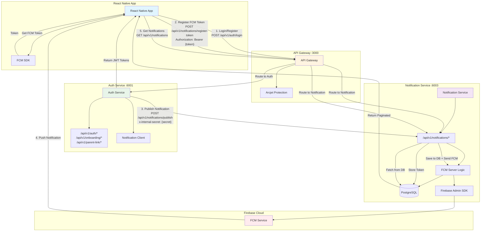
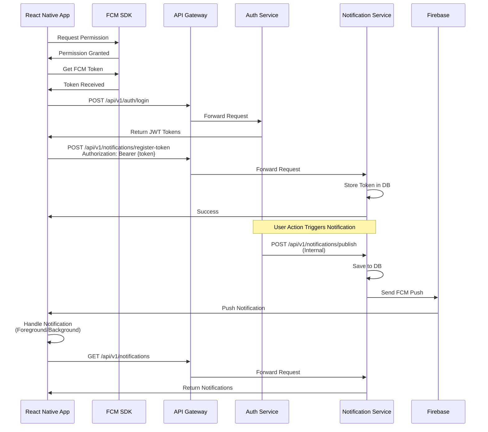

# React Native + FCM Integration Analysis

## Architecture Diagram



## Critical Issues You'll Face

### 1. **JWT Token Mismatch Between Services**

**Problem:**
- Auth service uses `JWT_ACCESS_SECRET` and `JWT_REFRESH_SECRET`
- Notification service uses `JWT_ACCESS_SECRET` (from `JWT_SECRET` env var)
- If these don't match, React Native app can't authenticate with notification service

**Current Code:**
```typescript
// auth-service/src/utils/tokens.ts
const ACCESS_TOKEN_SECRET = process.env.JWT_ACCESS_SECRET

// notification-service/src/middleware/auth.ts
const jwtSecret = process.env.JWT_ACCESS_SECRET; // or JWT_SECRET?
```

**Solution:**
- Ensure both services use the same `JWT_ACCESS_SECRET` environment variable
- Standardize on `JWT_ACCESS_SECRET` (not `JWT_SECRET`)

---

### 2. **FCM Token Registration Timing**

**Problem:**
- FCM token might not be available immediately on app launch
- User might login before FCM token is ready
- Need to handle token refresh and re-registration

**Current Flow:**
```
App Launch → Login → Get FCM Token → Register Token
```

**Issues:**
- If user logs in before FCM token is ready, notifications won't work
- FCM tokens can change (refresh), need to update server
- Multiple devices = multiple tokens per user

**Solution:**
- Register FCM token after successful login
- Listen for FCM token refresh events
- Re-register token when it changes
- Handle token registration failures gracefully

---

### 3. **Background Notification Handling**

**Problem:**
- React Native needs special handling for background notifications
- iOS requires APNs configuration
- Android needs notification channels
- Foreground notifications need custom handling

**Current Backend:**
```typescript
// notification-service/src/utils/notifications.ts
const notification: admin.messaging.MulticastMessage = {
  notification: {
    title: getNotificationTitle(data.type),
    body: getNotificationBody(data.type, data),
  },
  data: {
    type: data.type,
    ...data
  }
}
```

**Issues:**
- No `click_action` or `sound` configuration
- No iOS-specific `apns` payload
- No Android notification channel ID
- Data payload might be too large (FCM limit: 4KB)

**Solution:**
- Add platform-specific payloads
- Configure notification channels for Android
- Add deep linking support (`click_action`)
- Validate payload size

---

### 4. **Token Validation and Cleanup**

**Problem:**
- Invalid tokens accumulate in database
- No automatic cleanup of expired tokens
- Token transfer logic might cause issues

**Current Code:**
```typescript
// notification-service/src/utils/fcm-tokens.ts
if (existingToken.userId !== userId) {
  // Token belongs to another user, transfer it
  await prisma.fcmToken.update({...})
}
```

**Issues:**
- Token transfer might send notifications to wrong user temporarily
- No validation that token is still valid before transfer
- Invalid tokens only removed after failed FCM send

**Solution:**
- Validate token before transfer
- Add periodic cleanup job for old tokens
- Better error handling for invalid tokens

---

### 5. **CORS and API Gateway Configuration**

**Problem:**
- API Gateway CORS only allows `localhost:3000` and `localhost:8080`
- React Native uses different origins (file://, expo://, etc.)
- Mobile apps don't have "origin" header

**Current Code:**
```typescript
// api-gateway/src/main.ts
app.use(cors({
    origin: ["http://localhost:3000", "http://localhost:8080"],
    credentials: true,
    allowedHeaders: ["Content-Type", "Authorization", "x-refresh-token"],
}));
```

**Solution:**
- Allow all origins for mobile apps (or use wildcard)
- Remove origin restriction for mobile clients
- Keep credentials: true for cookie support (if needed)

---

### 6. **Internal Service Authentication**

**Problem:**
- Auth service calls notification service with `x-internal-secret`
- If secret is missing or wrong, notifications fail silently
- No retry mechanism

**Current Code:**
```typescript
// auth-service/src/utils/notifications-client.ts
const response = await fetch(`${NOTIFICATION_SERVICE_URL}/api/v1/notifications/publish`, {
  headers: {
    'x-internal-secret': process.env.INTERNAL_SERVICE_SECRET,
  }
});
// Don't throw - notification failure shouldn't break the request
```

**Issues:**
- Silent failures make debugging hard
- No logging of notification failures
- No retry mechanism

**Solution:**
- Add proper error logging
- Implement retry logic with exponential backoff
- Add monitoring/alerting for notification failures

---

### 7. **Notification Data Structure**

**Problem:**
- Notification data is stored as JSON
- React Native needs to parse and handle different notification types
- No type safety on frontend

**Current Structure:**
```typescript
{
  type: "parent_link_request",
  requestId: "...",
  parent: { id, username, name },
  status: "...",
  respondedAt: "..."
}
```

**Issues:**
- Inconsistent data structures
- No TypeScript types for React Native
- Hard to handle different notification types

**Solution:**
- Create TypeScript interfaces for notification types
- Standardize notification data structure
- Add validation on backend

---

### 8. **Multiple Device Support**

**Problem:**
- User can have multiple devices
- All devices receive notifications
- No way to target specific device
- Token management complexity

**Current Implementation:**
```typescript
// Sends to ALL user's devices
const tokens = await getUserFcmTokens(userId);
await messaging.sendEachForMulticast({ tokens, ... });
```

**Issues:**
- Can't send to specific device
- No device grouping (e.g., "mobile" vs "tablet")
- All devices get same notification

**Solution:**
- Add device grouping/tagging
- Allow targeting specific devices
- Add device metadata (app version, OS version)

---

### 9. **Notification Read Status Sync**

**Problem:**
- Notification marked as read in app
- Need to sync with backend
- Multiple devices = sync complexity

**Current API:**
```typescript
PATCH /api/v1/notifications/read
Body: { notificationId: "...", markAll: false }
```

**Issues:**
- No real-time sync between devices
- If user reads on device A, device B still shows unread
- No WebSocket/SSE for real-time updates

**Solution:**
- Add WebSocket/SSE for real-time sync
- Or poll periodically for read status updates
- Consider using Firebase Realtime Database for sync

---

### 10. **Error Handling and Retry Logic**

**Problem:**
- No retry logic for failed FCM sends
- No queue system for failed notifications
- Network failures cause lost notifications

**Current Code:**
```typescript
// Just logs error, no retry
catch (error) {
  console.error("Error publishing notification:", error);
  // Don't throw - notification failure shouldn't break the request
}
```

**Issues:**
- Failed notifications are lost
- No way to retry later
- No dead letter queue

**Solution:**
- Implement retry queue (Redis/Bull)
- Add exponential backoff
- Dead letter queue for permanently failed notifications

---

## Recommended React Native Implementation Flow



## Action Items

### Immediate Fixes:
1. ✅ Standardize JWT secret env vars across services
2. ✅ Update CORS to allow mobile app origins
3. ✅ Add proper error logging for notification failures
4. ✅ Add notification payload size validation

### Short-term Improvements:
5. Add FCM token refresh handling
6. Implement retry logic for failed notifications
7. Add platform-specific notification payloads
8. Create TypeScript types for notifications

### Long-term Enhancements:
9. Add WebSocket for real-time notification sync
10. Implement notification queue system
11. Add device grouping/targeting
12. Add notification analytics

